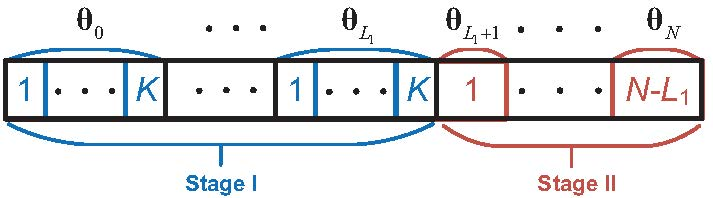
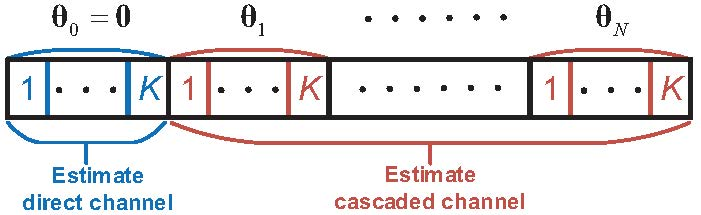
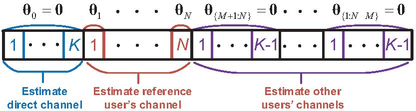

## IRS channel estimation

This repository contains the source codes of the paper ``Uplink Cascaded Channel Estimation for Intelligent Reflecting Surface Assisted Multiuser MISO Systems'' which is published in IEEE Transactions on Signal Processing (see <https://ieeexplore.ieee.org/document/9839429>).

In the paper, we propose a novel two-stage channel estimation protocol without the need of on-off amplitude control to avoid the reflection power loss which is shown as follows. Then optimization-based channel estimation is proposed based on the protocol.

The protocol can significantly reduce the overall pilot overhead and enhance the received pilot signal power by keeping all IRS elements to be on, while the existing protocols shown as follows (referred to a protocol 2&3) require larger pilot overhead or shutting down IRS elements during training.

## Introduction of the codes

Run the files ``plot_CE_compare.m'' and "plot_convergence.m". You may get the following figures

### Generate random channel

One may run following files in sequence according to the chanenl model in 3GPP TR 38.901:

+ ``channel_system_para_snap_elaa.m'': Random the scatters in the environment
+ ``channel_elaa_basis.m'': Calucate the channel covariances and path losses

### Main codes for the algorithms

The following are the main code files for the 5 baselines shown in the figure.

+ (Baseline 1)``CE_baseline_LMMSE.m'': LMMSE using protocol 2 
+ (Baseline 2)``CE_baseline_BALS.m'': BALS algorithm using protocol 2
+ (Baseline 3)``CE_baseline_BALS_map.m'':  MAP-enhanced BALS using protocol 2
+ (Baseline 4)``CE_baseline_improve.m'': Selected On-Off protocol shown as protocol 3
+ (Baseline 5)``CE_baseline_imp_sameP.m'': Increase the Tx power of Baseline 4 to be the same as Baselines 1&2&3  
+ ``baseline_cal_lambda.m'': Offline estimating the statistical knowledge for Baselien 4&5

The following are the main code files for the proposed algorithms.

+ ``iteration_final_MAP.m'': The convergence of the proposed algorithm with random IRS phase-shifting
+ ``iteration_opt_MAP.m'': The convergence of the proposed algorithm with optimized IRS phase-shifting
+ ``CE_proposed_MAP_final.m'': Channel estimation performance of the proposed solution with random IRS
+ ``CE_propose_cascade_optphi.m'': Channel estimation performance of the proposed soltuion with optimized IRS

## Note
You may cite us by   
@ARTICLE{9839429,  
author={Guo, Huayan and Lau, Vincent K. N.},  
journal={IEEE Transactions on Signal Processing},   
title={Uplink Cascaded Channel Estimation for Intelligent Reflecting Surface Assisted Multiuser {MISO} Systems},   
year={Early Access, doi=10.1109/TSP.2022.3193626},  
pages={1-14}  
}

One previous version of this paper is named ``Cascaded Channel Estimation for Intelligent Reflecting Surface Assisted Multiuser MISO Systems'', which can be found in ArXiv as well (see <https://arxiv.org/abs/2108.09002>).